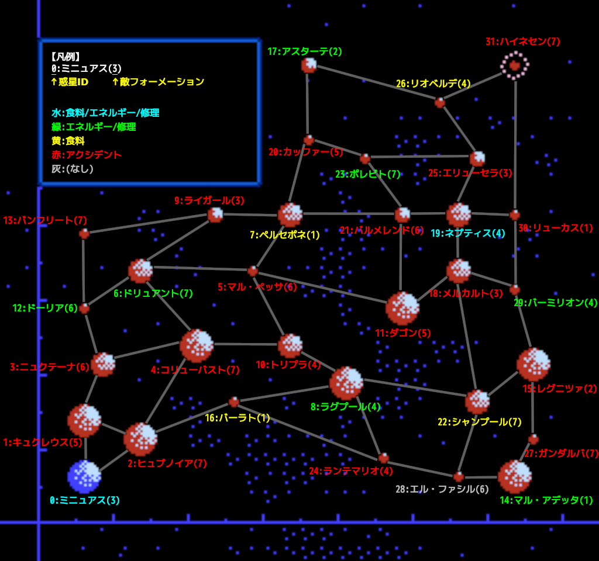

+++
title = "惑星"
date = 2022-07-15
+++

各惑星はそれぞれ固有の座標を持つ。  
また、惑星ごとに敵フォーメーションが決まっている。  
また、各惑星は「惑星種別」という値を持ち、これにより補給の可否やアクシデントの種類が決まる。

味方艦隊が「移動」または「退却」コマンドでアクシデントが起こりうる惑星に到着すると、1/4 の確率でアクシデントが起こる(判定は各艦隊指揮官からの入電直前に行われる)。  
このとき、惑星種別により食料/エネルギー/ダメージに決まった量の損害を受ける(これによる艦隊ダメージは上限 99)。  
ただし、コマンドが「戦闘」の場合はアクシデントが起こらない。つまり、戦闘に勝って惑星を占領した直後は決してアクシデントが起こらない。  
アクシデント発生時は惑星種別に応じたメッセージが出るが、エネルギー不足により輸送待ちになった場合はアクシデントメッセージが省略される(損害自体は受ける)。

各惑星は最大 4 つの隣接する惑星を持つ。  
味方艦隊が惑星に到着したとき、隣接するどの惑星にも移動命令を出せないならエネルギー不足と判定され、輸送待ちになる(待ち日数は `1..=4` の乱数)。  

移動命令におけるカーソル移動は惑星間の隣接関係に基づいて行われる。  
このとき、エネルギーが足りないとカーソル移動ができない。よって、ある惑星への移動命令を出すためには、経路上の全惑星への移動命令を出せることが必要である。  
たとえば、ダゴンからアスターテは距離 96 だが、経路上のカッファーorリオベルデへのカーソル移動ができないため、エネルギーが 100 あっても移動できない。

## 惑星種別

惑星種別は 17 種類ある (ゲーム中に登場しないものもある)。

| 種別 | 説明                                      |
| --   | --                                        |
| 0    | 食料補給/エネルギー補給/艦隊修理が可能    |
| 1    | 食料補給が可能                            |
| 2    | エネルギー補給/艦隊修理が可能             |
| 3    | アクシデント: エネルギー -20              |
| 4    | アクシデント: エネルギー -30, ダメージ 40 |
| 5    | アクシデント: ダメージ 20                 |
| 6    | アクシデント: エネルギー -30              |
| 7    | アクシデント: ダメージ 40                 |
| 8    | アクシデント: エネルギー -30, ダメージ 20 |
| 9    | アクシデント: ダメージ 10                 |
| 10   | アクシデント: ダメージ 30                 |
| 11   | アクシデント: ダメージ 40                 |
| 12   | アクシデント: ダメージ 10                 |
| 13   | アクシデント: 食料 -30                    |
| 14   | アクシデント: 食料 -50                    |
| 15   | (特になし)                                |
| 16   | (特になし)                                |

## 惑星データ {#data}

| ID | 名前           | 座標            | 種別 | 敵フォーメーション |
| -- | --             | --              | --   | --                 |
| 0  | ミニュアス     | (8, 8, 8)       | 0    | 3                  |
| 1  | キュクレウス   | (8, 16, 24)     | 7    | 5                  |
| 2  | ヒュプノイア   | (16, 8, 16)     | 12   | 7                  |
| 3  | ニュクテーナ   | (8, 32, 32)     | 7    | 6                  |
| 4  | コリューバスト | (24, 24, 32)    | 7    | 7                  |
| 5  | マル・ペッサ   | (32, 8, 40)     | 5    | 6                  |
| 6  | ドリュアント   | (16, 56, 48)    | 2    | 7                  |
| 7  | ペルセポネ     | (40, 40, 40)    | 1    | 1                  |
| 8  | ラグプール     | (64, 16, 24)    | 2    | 4                  |
| 9  | ライガール     | (32, 64, 80)    | 13   | 3                  |
| 10 | トリプラ       | (56, 56, 32)    | 10   | 4                  |
| 11 | ダゴン         | (80, 24, 48)    | 8    | 5                  |
| 12 | ドーリア       | (8, 120, 56)    | 2    | 6                  |
| 13 | バンフリート   | (8, 104, 56)    | 4    | 7                  |
| 14 | マル・アデッタ | (120, 16, 8)    | 2    | 1                  |
| 15 | レグニツァ     | (120, 8, 72)    | 12   | 2                  |
| 16 | バーラト       | (32, 104, 24)   | 1    | 1                  |
| 17 | アスターテ     | (48, 88, 112)   | 2    | 2                  |
| 18 | メルカルト     | (88, 48, 64)    | 6    | 3                  |
| 19 | ネプティス     | (104, 32, 88)   | 0    | 4                  |
| 20 | カッファー     | (48, 112, 88)   | 9    | 5                  |
| 21 | バルメレンド   | (80, 80, 72)    | 11   | 6                  |
| 22 | シャンプール   | (112, 48, 56)   | 1    | 7                  |
| 23 | ポレビト       | (72, 112, 80)   | 2    | 7                  |
| 24 | ランテマリオ   | (96, 96, 24)    | 4    | 4                  |
| 25 | エリューセラ   | (112, 72, 96)   | 5    | 3                  |
| 26 | リオベルデ     | (96, 120, 104)  | 1    | 4                  |
| 27 | ガンダルバ     | (120, 96, 32)   | 3    | 7                  |
| 28 | エル・ファシル | (112, 120, 48)  | 16   | 6                  |
| 29 | バーミリオン   | (112, 112, 88)  | 2    | 4                  |
| 30 | リューカス     | (120, 112, 104) | 9    | 1                  |
| 31 | ハイネセン     | (120, 120, 120) | 10   | 7                  |

## マップ

隣接する惑星同士は辺で結んでいる(一方通行は存在しない)。

